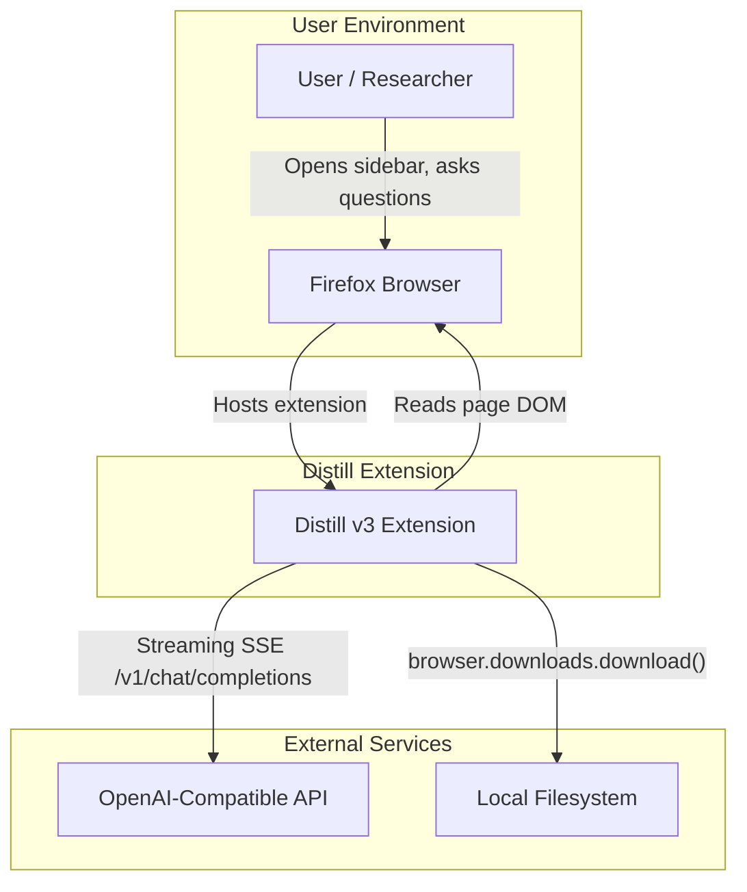
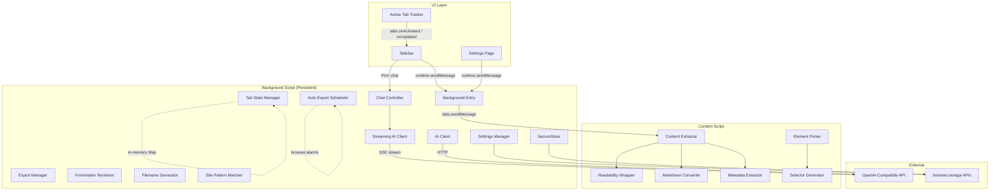
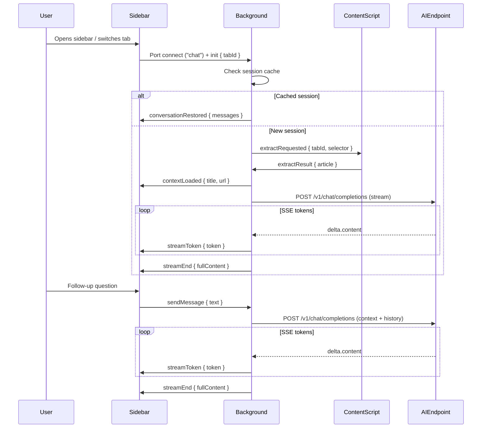
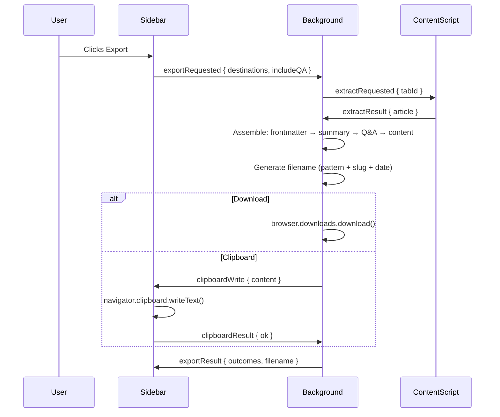
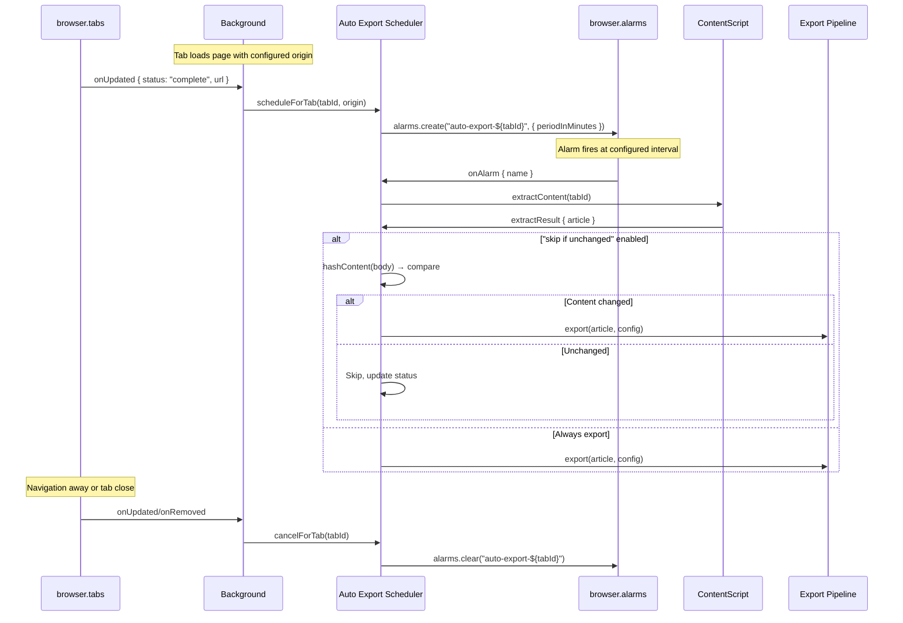
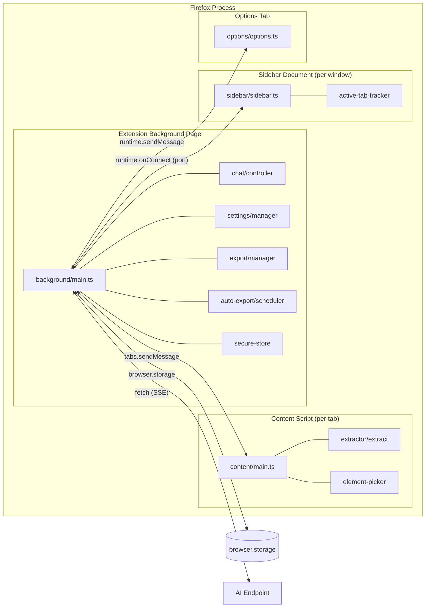
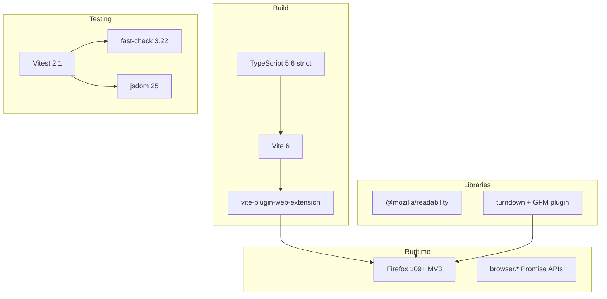

# Distill v3

A Firefox extension (Manifest V3) that extracts web page content, generates AI summaries via a sidebar, supports follow-up Q&A chat with streaming responses, and exports unified Markdown documents.

## Features

- **AI-Powered Summarization** — Automatically summarizes the active page when the sidebar opens, with structured output (Findings, Key Points, Action Items)
- **Follow-up Q&A Chat** — Ask questions about the page content with full conversation context and streaming token delivery
- **Content Extraction** — Smart heuristic detection via `@mozilla/readability` with manual element picker recovery
- **Markdown Export** — Unified documents combining frontmatter, summary, Q&A, and cleaned page content
- **Auto-Export Scheduling** — Periodic content capture for configured sites using `browser.alarms`
- **Site Patterns** — Configurable CSS selectors per-site for reliable extraction across different layouts
- **API Key Storage** — keys live outside settings, AES-GCM obfuscated at rest in `browser.storage.local` (protects against casual inspection of storage dumps; the encryption key itself is stored locally, so this is not protection against code with storage access)

## Requirements

- Firefox 109+ (first version with MV3 support)
- Node.js 18+
- An OpenAI-compatible API endpoint (any provider supporting `/v1/chat/completions`)

## Build & Development

```bash
# Install dependencies
npm install

# Development build with hot reload
npm run dev

# Production build
npm run build

# Run tests (single run)
npm test

# Run tests in watch mode
npm run test:watch
```

### Loading in Firefox

1. Run `npm run build` to produce the `dist/` folder
2. Open `about:debugging#/runtime/this-firefox`
3. Click "Load Temporary Add-on" and select `dist/manifest.json`

## Configuration

After installing, open the extension's Settings page (right-click toolbar icon → "Manage Extension" → "Options") to configure:

| Setting | Description |
|---------|-------------|
| AI Base URL | OpenAI-compatible endpoint (e.g., `https://api.openai.com`) |
| Model ID | Model identifier (e.g., `gpt-4`, `gpt-4o`) |
| API Key | Encrypted at rest via AES-GCM SecureStore |
| Filename Pattern | Tokens: `YYYY`, `MM`, `DD`, `slugified-title` |
| Site Patterns | URL match patterns + CSS content selectors (max 50) |
| Auto-Export | Per-origin interval (1–120 min), destination, mode; change detection via FNV-1a hash of the full exported content |

## Architecture

### System Context (Enterprise Viewpoint)



### Logical Component View



### Information Flow: Summary & Chat



### Information Flow: Export Pipeline



### Process View: Auto-Export Scheduling



### Deployment View: Extension Contexts



### Technology Stack



## Project Structure

```
src/
├── background/           # Persistent background script
│   ├── main.ts           # Entry point, message routing, event wiring
│   ├── ai/              # Non-streaming AI client (connection test)
│   ├── auto-export/     # Scheduler, hasher, filename generator
│   ├── chat/            # Chat controller, streaming SSE client
│   ├── export/          # Export manager (document assembly)
│   ├── render/          # Frontmatter renderer, filename generator
│   ├── settings/        # Settings manager, defaults, validation
│   ├── site-patterns/   # URL pattern matcher
│   ├── secure-store.ts  # AES-GCM encrypted key storage
│   └── tab-state.ts     # In-memory per-tab state
├── content/             # Content scripts (injected into pages)
│   ├── main.ts          # Message handler entry point
│   ├── extractor/       # Readability wrapper, Markdown converter, metadata
│   ├── element-picker.ts # Visual element selection overlay
│   └── selector-generator.ts # Stable CSS selector generation
├── sidebar/             # Sidebar UI (per-window)
│   ├── sidebar.ts       # Chat interface, state machine
│   ├── active-tab-tracker.ts # Window-aware tab tracking
│   ├── sidebar.html
│   └── sidebar.css
├── options/             # Settings page
│   ├── options.ts
│   ├── options.html
│   └── options.css
└── shared/              # Cross-context utilities
    ├── messages.ts      # Typed message envelope system
    ├── port-protocol.ts # Sidebar ↔ controller port types
    ├── storage.ts       # Storage adapter interfaces
    ├── types.ts         # Result unions, data models, settings
    └── url-utils.ts     # URL comparison utilities
```

## Design Principles

| Principle | Implementation |
|-----------|---------------|
| Dependency injection | Factory functions with options objects; all externals injectable |
| Result unions over exceptions | `{ ok: true, ... } \| { ok: false, reason, detail }` for expected failures |
| Typed messaging | Closed discriminated union envelope with compile-time narrowing |
| Security | API keys never stored inside settings; AES-GCM obfuscated at rest; sanitized markdown rendering in the sidebar |
| Testability | ~890 tests (unit + property-based + integration) with injectable deps throughout |
| Firefox-native | `browser.*` promise APIs, `sidebar_action`, persistent background page |

## Testing

The project uses a three-tier testing strategy:

- **Unit tests** (`*.test.ts`) — Focused behavior verification with mocked dependencies
- **Property-based tests** (`*.prop.test.ts`) — Universal correctness properties via `fast-check`
- **Integration tests** (`*.integration.test.ts`) — End-to-end flows across module boundaries

```bash
# Run all tests
npm test

# Run only the core-feature regression suite (tests tagged with CF- ids)
npm run test:regression

# Typecheck
npm run typecheck

# Run specific test file
npx vitest run src/background/chat/controller.test.ts

# Run property tests only
npx vitest run prop.test
```

Intended behavior is specified in [`REQUIREMENTS.md`](REQUIREMENTS.md) — core-feature tests
reference its CF-x acceptance criteria in their `describe` names, which is what makes the
regression filter (`vitest run -t CF-`) work.

## License

Private — not published to any registry.
